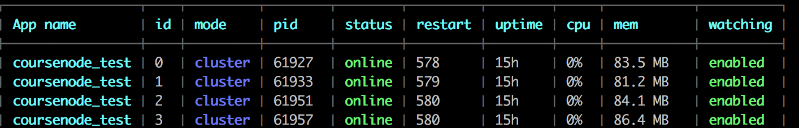
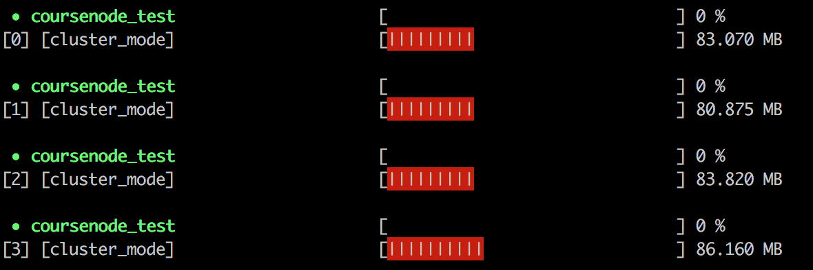

# PM2

- [简介](#简介)
- [基本用法](#基本用法)
- [日志管理](#日志管理)
- [配置文件](#配置文件)

## 简介

pm2 是一个带有负载均衡功能的Node应用的进程管理器.

当你要把你的独立代码利用全部的服务器上的所有CPU，并保证进程永远都活着，0秒的重载， PM2是完美的。它非常适合IaaS结构，但不要把它用于PaaS方案。

> 备注：
> - SaaS、PaaS 和 IaaS 是云服务模式
> - SaaS 软件即服务，例如 Google 的 Gmail 邮箱服务，面向应用型用户
> - PaaS 平台即服务，例如 Google 的 GAE，面向开发型用户
> - IaaS 基础架构即服务，例如亚马逊的 AWS，IaaS 对于不知道新推出的应用程序/网站会有多成功的创业公司来说非常有用

### 主要特性
- 内建负载均衡（使用 Node cluster 集群模块）
后台运行
- 0 秒停机重载，我理解大概意思是维护升级的时候不需要停机.
- 控制台检测
- 提供 HTTP API
- 远程控制和实时的接口 API ( Nodejs 模块，允许和 PM2 进程管理器交互 )

## 基本用法

安装： `$ npm install -g pm2`

### 常用命令：

**启动服务：**

基础命令：`$ pm2 start app.js`

命令参数：
- `-i` or `--instance [n]`。表示后台创建几个进程。n可以是具体数字，也可以是`max` —— 根据当前机器CPU核心数确定实例数目
- `-n` or `--name <name>`。用以命名进程
- `--watch`。监听应用目录的变化，一旦发生变化，自动重启。
- `--ignore-watch`。排除监听的目录/文件，可以是特定的文件名，也可以是正则。
- `-o` or `--output <path>`。标准输出日志文件的路径。
- `-e` or `--error <path>`：错误输出日志文件的路径。

> 命令示例：`$ pm2 start app.js --watch -i 2`

**其他命令：**

-  `$ pm2 list`： 显示所有进程状态



- `$ pm2 monit`：监视所有进程的cpu和内存情况



- `$ pm2 logs`：显示所有进程日志，这个后面会详细介绍。
- 停止进程：`$ pm2 stop [id或all] `
- `$ pm2 restart [id或者all]`：重启进程
- `$ pm2 reload all`：0 秒停机重载进程 (用于 NETWORKED 进程)

- `$ pm2 delete [id或all]：杀死进程

## 日志管理
PM2允许您轻松管理应用程序的日志。您可以实时显示来自所有应用程序的日志。有不同的方法来配置PM2如何处理您的日志（在不同的文件中分离，合并，使用时间戳...），而无需修改代码中的任何内容。

实时显示指定进程或所有进程的日志：
```
# Display all apps logs
$ pm2 logs

# Display only api app logs
$ pm2 logs api

# Display X lines of api log file
$ pm2 logs big-api --lines 1000
```
从PM2 2.x开始，您可以使用以下--json选项查看JSON格式的日志：

```
$ pm2 logs --json
```
从PM2 2.x开始，您可以看到具有特殊日期格式的日志，只需使用以下--format选项：
```
$ pm2 logs --format
```

更多命令行参数：
```
--raw                # raw output
--err                # only shows error output
--out                # only shows standard output
--lines <n>          # output the last N lines, instead of the last 15 by default
```

### 直接输出json日志

启动PM2 2.4.0，您可以直接使用pm2输出json中的日志：

- CLI： --log-type json
- 流程文件： "log_type": "json"

这将把日志输出为json对象err和out文件，看一个json对象的例子：
```
{
   "message": "echo\n",                     // the actual message that has been `console.log`
   "timestamp": "2017-02-06T14:51:38.896Z", // timestamp of the message, can be formated
   "type": "out",                           // the type of logs, can be `err`, `out` or `PM2`
   "process_id": 0,                         // the process id used by PM2
   "app_name": "one-echo"                   // the application name
}
```
清空PM2管理的所有当前应用程序日志：
```
$ pm2 flush   # Clear all the logs
```

### 启动PM2时的日志配置

1. CLI

例：
```
$ pm2 start echo.js --merge-logs --log-date-format="YYYY-MM-DD HH:mm Z"
```

参数选项：
```
--merge-logs                 do not postfix log file with process id
--log-date-format <format>   prefix logs with formated timestamp
-l --log [path]              specify entire log file (error and out are both included)
-o --output <path>           specify out log file
-e --error <path>            specify error log file
```
2. JSON方式(推荐)
```javascript
// config.json
 {
  "script"          : "echo.js",
  "error_file"      : "err.log",
  "out_file"        : "out.log",
  "merge_logs"      : true,
  "log_date_format" : "YYYY-MM-DD HH:mm Z"
}
```
```
$ pm start config.json
```

## 配置文件

配置文件里的设置项，跟命令行参数基本是一一对应的,可以选择yaml或者json文件。

json格式的配置文件，pm2当作普通的js文件来处理，所以可以在里面添加注释或者编写代码，这对于动态调整配置很有好处。

**如果启动的时候指定了配置文件，那么命令行参数会被忽略。（个别参数除外，比如--env）**

举个简单例子，完整配置说明请参考[官方文档](http://pm2.keymetrics.io/docs/usage/pm2-doc-single-page/)。
```javascript
{
  "name"        : "fis-receiver",  // 应用名称
  "script"      : "./bin/www",  // 实际启动脚本
  "cwd"         : "./",  // 当前工作路径
  "watch": [  // 监控变化的目录，一旦变化，自动重启
    "bin",
    "routers"
  ],
  "ignore_watch" : [  // 从监控目录中排除
    "node_modules",
    "logs",
    "public"
  ],
  "watch_options": {
    "followSymlinks": false
  },
  "error_file" : "./logs/app-err.log",  // 错误日志路径
  "out_file"   : "./logs/app-out.log",  // 普通日志路径
  "env": {
      "NODE_ENV": "production"  // 环境参数，当前指定为生产环境
  }
}
```
